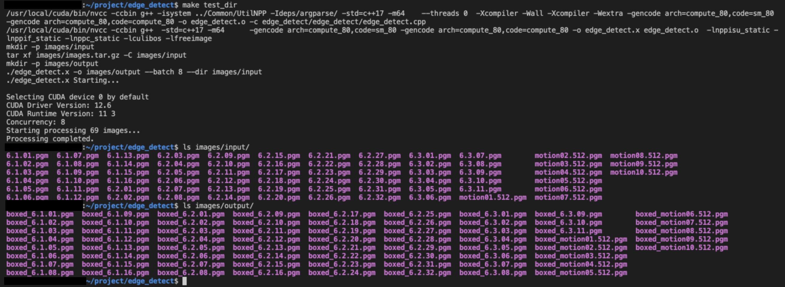

# NPP Exercise
This is an exercise to show NPP capabilities by applying a [Canny Border Filter](https://docs.nvidia.com/cuda/npp/image_filtering_functions.html#image-filter-canny-border) to one or more input images in PGM format. For each input image, the filter is applied by calling the NPP function [`nppiFilterCannyBorder_8u_C3C1R_Ctx`](https://docs.nvidia.com/cuda/npp/image_filtering_functions.html#c.nppiFilterCannyBorder_8u_C3C1R_Ctx) and the output is stored into a PMG image with the same name and a `boxed_` prefix.

This implementation exploits the available concurrency on a CUDA device by [duble-buffering](https://en.wikipedia.org/wiki/Multiple_buffering) the execution of the various operations. For more details about the double buffering implementation, see [the dedicated section](#double-buffering-implementation).

# Quickstart
For the basic functionalities, a [`Makefile`](Makefile) is available. It automatically downloads the dependencies (see [the list of dependencies](#dependencies-and-licenses)) and builds the executable when needed and requires no manual intervention nor extra arguments.
To compile and run on a single image, you may run

```bash
make test
```

To compile and run on an entire set of images, you may run

```bash
make test_dir
```

This command:

1. builds the executable `edge_detect.x`
2. creates the directory `images/input`
3. extracts the PGM images inside `images/images.tar.gz` into `images/input`
4. creates the directory `images/output`
5. runs `edge_detect.x` in the directory `images/input` with output into `images/output`

To just compile

```bash
make build
```

To clean everything

```bash
make distclean
```

To clean only the built binaries

```bash
make clean
```

To see the synopsis

```bash
$ ./edge_detect.x --help
Usage: edge_detect [--help] [-o VAR] [--batch VAR] [--dir] input

Positional arguments:
  input       input file or directory (see '--dir' option)

Optional arguments:
  -h, --help  shows help message and exits
  -o          output file or directory (depending on input) [nargs=0..1] [default: "."]
  --batch     batch size (none means decide from hardware)
  --dir       input is a directory
```

To generate the code documentation (via [doxygen](https://www.doxygen.nl)) run

```bash
make doxygen
```

which will produce it in HTML format, with home at `docs/html/index.html`.

## Proof of execution
If you run `make test_dir`, you may see the following



At the beginning you see the compilation and the run commands, while at the end you see the output images in `images/output`, whose names correspond to the input images (middle `ls images/input` command) with a `boxed_` prefix.

## Code structure and organization
The structure of the repository follows the [C++ Canonical Project Structure](https://www.open-std.org/jtc1/sc22/wg21/docs/papers/2018/p1204r0.html).

The code is formatted via `make clang-format` and checked via `make clang-tidy`.

### Double buffering implementation
Processing a single image essentially consists in 3 steps, run in the following order:

1. `LOAD`: loading it from file and initializing the related NPP objects (memory alloactions, data copies, ...);
2. `PROCESS`: sending the data to the device, running the computation and loading results into main memory;
3. `STORE`: storing the result image into a file.

The current implementation runs these steps in a double buffered way, to overlap the operations `LOAD` and `PROCESS` (run together) with 3. Furthermore, multiple operations are sent concurrently to the CUDA device in an asynchronous fashion via CUDA streams, thus leveraging the available parallelism. In particular, the user can control the number of parallel operations via the command-line argument `--batch <BATCH_SIZE>`, where `<BATCH_SIZE>` is the desired batch size, i.e., the number of operations of type `LOAD`-and-`PROCESS` or `STORE` issued to the device. The algorithm is summarised by the following Python-like pseudo code:

```python
# user's inputs
IMAGES := [0, N) list of N images to be processed
BATCH_SIZE := size of a single batch

BATCHES = split IMAGES in groups of at most BATCH_SIZE images
# prologue: send first batch to device
BATCH = BATCHES[0]
for IMAGE in BATCH:
  LOAD(IMAGE)
  PROCESS(IMAGE)

# main loop: process following batches
for BATCH_NUM in [1, len(BATCHES)):
  # LOAD-PROCESS phase: send new batch
  BATCH = BATCHES[BATCH_NUM]
  for IMAGE in BATCH:
    LOAD(IMAGE)
    PROCESS(IMAGE)
  # STORE phase: gather result from previous batch and store them
  PREV_BATCH = BATCHES[BATCH_NUM-1]
  for IMAGE in PREV_BATCH:
    STORE(IMAGE)

# epilogue: gather results of last sent batch and store
PREV_BATCH = BATCHES[len(BATCHES)-1]
for IMAGE in PREV_BATCH:
  STORE(IMAGE)
```

Keeping track of in-flight operations requires intermediate data structures: `<BATCH_SIZE>` data structures are written in the *LOAD-PROCESS phase* (iteration `BATCH_NUM`) to keep track of images sent to the device for processing; `<BATCH_SIZE>` data structures are read during the *STORE phase*, to gather the results of the previous LOAD-PROCESS phase (iteration `BATCH_NUM-1`) and store them on disk. At the end of each `BATCH_NUM` iteration, these data structures are swapped, so that the first group of them (written in the *LOAD-PROCESS phase*) is read during the following *STORE phase* and the second group (read in the *STORE phase* and thus not needed anymore) is re-used in the following *LOAD-PROCESS phase*.

## Inspecting the output
To inspect the output, you may want to convert it from PGM to PNG using [ImageMagick](https://imagemagick.org)

```bash
magick <file name>.pgm <file name>.png
```

## Dependencies and Licenses
The **images** inside `images/images.tar.gz` (used as input) were downloaded from https://sipi.usc.edu/database/database.php?volume=sequences (where they are freely available) and converted to PGM in order to avoid flooding warnings.

> [!NOTE]
> To convert each image, the following command was used
> ```bash
> magick <file name>.tiff -depth 8 <file name>.pgm
> ```

The [`argparse`](https://github.com/p-ranav/argparse) library is available under [MIT License](https://github.com/p-ranav/argparse/blob/master/LICENSE).

The [`cuda-samples`](https://github.com/NVIDIA/cuda-samples) (v13.0) are required to compile the executable and are available under [their own license](https://github.com/NVIDIA/cuda-samples/blob/v13.0/LICENSE).
